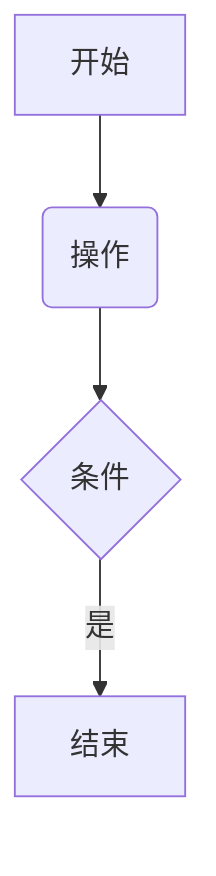

# markdown基本语法

>  Markdown (MD) 是现在普遍使用的一种文档书写语言格式，只需用一些非常简单易记的符号，如（# * / > [] ()\ ），就可以轻松写出一篇具有良好的排版和可读性的文章。

## 语法示例

## 一、基础排版

### 1. 标题

```
# H1
## H2
### H3
#### H4
##### H5
###### H6
```

### 2. 文字样式

| 语法           | 效果          |
| :------------- | :------------ |
| `**粗体**`     | **粗体**      |
| `*斜体*`       | *斜体*        |
| `***粗斜体***` | ***粗斜体***  |
| `~~删除线~~`   | ~~删除线~~    |
| `==高亮==`     | ==高亮==      |
| `H~2~O`        | H~2~O（下标） |
| `x^2^`         | x^2^（上标）  |


### 2.LaTeX公式

LaTeX数学公式有两种：行中公式和独立公式（行间公式）。行中公式放在文中与其它文字混编，独立公式单独成行。

#### 2.1 行内公式

`$E=mc^2$`
$E=mc^2$

#### 2.2 独立公式

`$$E=mc^2$$`
$$E=mc^2$$

#### 2.3 复杂公式

```language
$$\begin{array}{c}
 
\nabla \times \vec{\mathbf{B}} -\, \frac1c\, \frac{\partial\vec{\mathbf{E}}}{\partial t} &
= \frac{4\pi}{c}\vec{\mathbf{j}}    \nabla \cdot \vec{\mathbf{E}} & = 4 \pi \rho \\
 
\nabla \times \vec{\mathbf{E}}\, +\, \frac1c\, \frac{\partial\vec{\mathbf{B}}}{\partial t} & = \vec{\mathbf{0}} \\
 
\nabla \cdot \vec{\mathbf{B}} & = 0
 
\end{array}$$
```

$$
\begin{array}{c}

\nabla \times \vec{\mathbf{B}} -\, \frac1c\, \frac{\partial\vec{\mathbf{E}}}{\partial t} &
= \frac{4\pi}{c}\vec{\mathbf{j}}    \nabla \cdot \vec{\mathbf{E}} & = 4 \pi \rho \\

\nabla \times \vec{\mathbf{E}}\, +\, \frac1c\, \frac{\partial\vec{\mathbf{B}}}{\partial t} & = \vec{\mathbf{0}} \\

\nabla \cdot \vec{\mathbf{B}} & = 0

\end{array}
$$


**更多语法参考：**[《51CTO开源基础软件社区-Markdown 编辑器添加 Latex数学公式教程》](https://harmonyos.51cto.com/posts/3842)


希腊字母表


### 4.绘制表格

| Column 1 | Column 2 | Column 3 |
| -------- | -------: | :------: |
| cell 1   |   cell 2 |  cell 3  |
| cell 4   |   cell 5 |  cell 6  |
| cell 7   |   cell 8 |  cell 9  |


### 8.Todo列表

语法：

> \- [ ] **社区直播公开课开展情况**
> \- [x] 5分钟搞定俄罗斯方块---组件化实战
> \- [x] HarmonyOS应用服务早期红利与各项技术场景创新分析
> \- [ ] 从萌新到高手——怎样快速掌握鸿蒙开发

显示：

- [ ] **社区直播公开课开展情况**
- [x] 5分钟搞定俄罗斯方块---组件化实战
- [x] HarmonyOS应用服务早期红利与各项技术场景创新分析


### 3. 段落与引用

```
普通段落（直接换行需末尾加两个空格）

> 单层引用
>> 嵌套引用
```

### 4. 列表

#### 无序列表

```
- 项目1
  - 子项目
    * 三级项目（支持`+`/`-`/`*`）
```

#### 有序列表

```
1. 第一项
   1. 子项
      a. 三级项（字母需手动）
```

#### 任务列表

```
- [x] 已完成
- [ ] 未完成（注意空格）
```

### 5. 分割线

```
--- 或 *** 或 ___
```

------

## 二、代码与表格

### 1. 代码块

#### 行内代码

```
`code`` → `code
```

#### 语法高亮

````python
```python
print("Hello World!")
```
````

### 2. 表格

markdown

复制

```
| 左对齐 | 居中对齐 | 右对齐 |
|:-------|:-------:|-------:|
| 数据1  | 数据2   | 数据3  |
```

------

## 三、链接与媒体

### 1. 链接

markdown

复制

```
[文本](URL)
<直接显示URL>
[锚点](#标题名)
```

### 2. 图片

markdown

复制

```

```

### 3. 图床推荐

- 本地图片：直接拖拽上传（支持多数平台）
- 在线图床：Imgur、SM.MS、GitHub仓库+CDN

------

## 四、高级功能

### 1. LaTeX公式

#### 行内公式

`$E=mc^2$` → E=mc2*E*=*m**c*2

#### 块公式

latex

复制

```
$$
\begin{matrix}
a & b \\
c & d
\end{matrix}
$$
```

### 2. 流程图/时序图

markdown

复制

````

````

### 3. HTML扩展

html

复制

```
<font color="red">红色文字</font>
<span style="color:blue">蓝色文字</span>
```

运行 HTML

------

## 五、兼容性说明

1. **平台差异**：

   - 高亮标记（`==`）和上标（`^`）需平台支持
   - Mermaid图表需安装插件（如VS Code）

2. **转义字符**：

   markdown

   复制

   ```
   \# 显示井号（避免被解析为标题）
   ```

3. **编辑器锁定**：

   - 富文本与Markdown模式不可切换


### 13. 分割线

可以在一行中用三个以上的星号、减号、底线来建立一个分隔线，同时需要在分隔线的上面空一行。
例：
`-------`
`*****`
`______`


-------


### 16. 颜色

使用 `$\color{颜色}{文字}$` 来更改特定的文字颜色。
更改文字颜色 需要浏览器支持，如果不支持则文字将被渲染为黑色。

输入 `$\color {#rgb} {text}$` 来自定义更多的颜色，示例：
**语法：**

```html/xml
$\begin{array}{|rrrrrrrr|}\hline
\verb+#000+ & \color{#000}{text} & & &
\verb+#00F+ & \color{#00F}{text} & & \\
& & \verb+#0F0+ & \color{#0F0}{text} &
& & \verb+#0FF+ & \color{#0FF}{text}\\
\verb+#F00+ & \color{#F00}{text} & & &
\verb+#F0F+ & \color{#F0F}{text} & & \\
& & \verb+#FF0+ & \color{#FF0}{text} &
& & \verb+#FFF+ & \color{#FFF}{text}\\
\hline
\end{array}$
```

**显示：**
$\begin{array}{|rrrrrrrr|}\hline
\verb+#000+ & \color{#000}{text} & & &
\verb+#00F+ & \color{#00F}{text} & & \\
& & \verb+#0F0+ & \color{#0F0}{text} &
& & \verb+#0FF+ & \color{#0FF}{text}\\
\verb+#F00+ & \color{#F00}{text} & & &
\verb+#F0F+ & \color{#F0F}{text} & & \\
& & \verb+#FF0+ & \color{#FF0}{text} &
& & \verb+#FFF+ & \color{#FFF}{text}\\
\hline
\end{array}$


注释
*[HTML]:   超文本标记语言


最后，献上几个示例~，在gitee上，仅供参考

[^1]: 注脚的解释,一般都在最后


